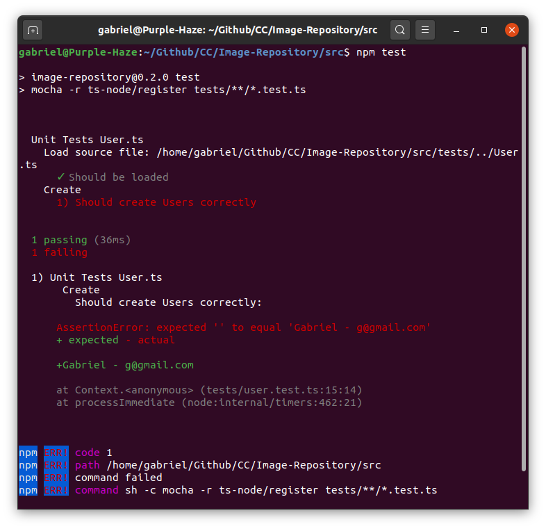
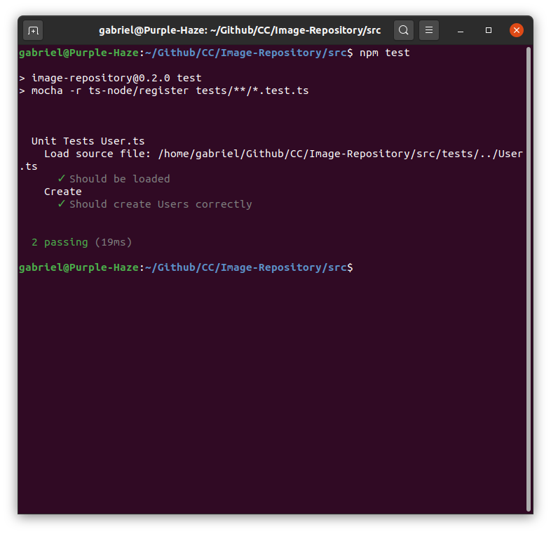

# Ejercicio 2.4. Escribir una serie de aserciones y pronar que no fallan. Añadir tests  para una nueva funcionalidad y comprobar que fallan. Escribir código para superar los tests y ejecutar mocha

