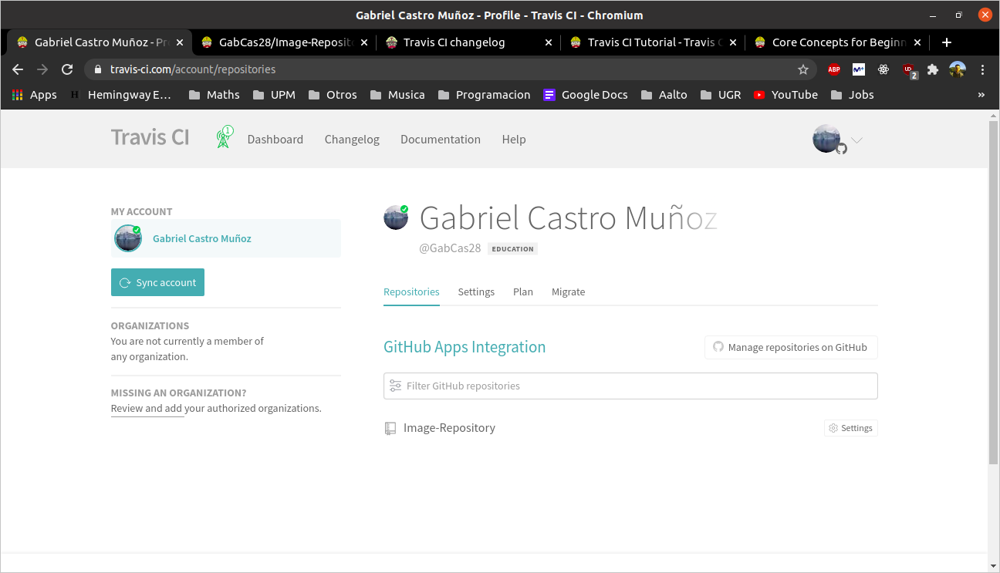

# Exercise 4.1

## 1. Darse de alta. Muchos están conectados con GitHub por lo que puedes autentificarte directamente desde ahí. A través de un proceso de autorización, puedes acceder al contenido e incluso informar del resultado de los tests a GitHub

## 2. Activar el repositorio en el que se vaya a aplicar la integración continua. Travis permite hacerlo directamente desde tu configuración; en otros se dan de alta desde la web de GitHub

