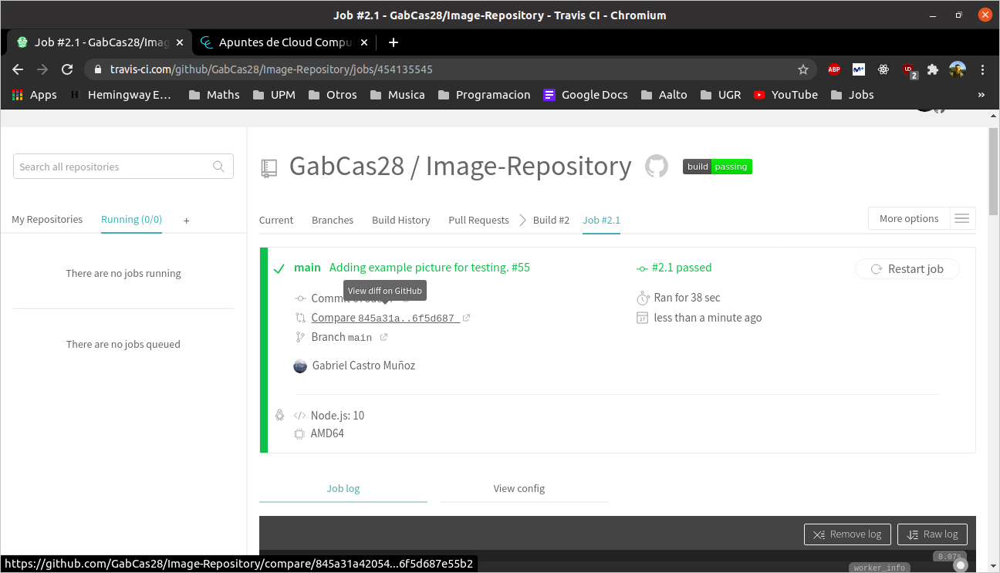

# Exercise 4.2

## Configurar integración continua para nuestra aplicación usando Travis o algún otro sitio.

### .travis.yml

    language: node_js
    node_js:
    - "5"
    - "6"
    - "7"
    - "8"
    - "9"
    before_install:
    - npm install -g mocha
    install:
    - npm install .
    script: npm test

### Build success

